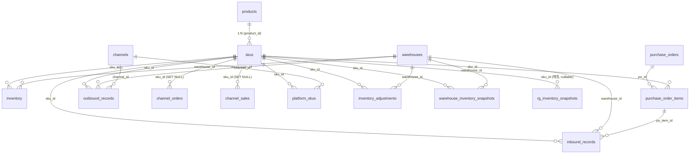

# 재고 · 입출고 · 주문 데이터 모델과 흐름

> seller-erp 의 재고 관련 테이블 관계와 재고가 실제로 변동·반영되는 메커니즘 정리.
> 코드 기준 작성일: 2026-06-04 (마이그레이션 + API 라우트 + DB 트리거 실측).

---

## 1. 한눈에 — 핵심 요약

- **재고 저장 단위:** `inventory` = **SKU × 창고(warehouse)별 수량**.
- **재고 변동은 전부 DB 트리거로 즉시(real-time) 반영** — 주문/입고/출고/취소 행이 DB 에 쓰이는 순간 자동 가감.
- **단, 외부 마켓(쿠팡/네이버/토스) 판매는 실시간이 아님** — 주문을 **하루 1회(08:00 KST) 자동 + 수동 버튼**으로 끌어와서 그때 반영.
- **화면은 새로고침 기준** — 재고에는 실시간 푸시(웹소켓) 없음.

---

## 2. 테이블 관계 (ER)

### 마스터(기준 정보)
| 테이블 | 역할 | 주요 FK |
|---|---|---|
| `products` | 상품(모델 단위) | — |
| `skus` | 옵션 단위 재고 키. `sku_code` UNIQUE, `cost_price`(매입원가), `lead_time_days`, `reorder_point`(발주점), `safety_stock` | `product_id → products` (CASCADE) |
| `warehouses` | 창고. `type ∈ own / coupang / 3pl / other` | — |
| `channels` | 판매 채널. `type ∈ coupang / toss / smartstore / other` | — |
| `platform_skus` | SKU ↔ 플랫폼 등록상품/옵션 매핑(플랫폼 상품명·옵션·ID) | `sku_id → skus`, `channel_id → channels` |

### 재고 본체
| 테이블 | 역할 | 주요 FK |
|---|---|---|
| `inventory` | **현재 재고** = SKU × 창고별 수량 | `sku_id → skus`, `warehouse_id → warehouses` |
| `inventory_adjustments` | 수동 재고 조정 이력(before/after/사유) | `sku_id`, `warehouse_id` |
| `warehouse_inventory_snapshots` | **일별** 자사 재고 스냅샷(추이/예측용) | `sku_id`, `warehouse_id` |
| `rg_inventory_snapshots` | 쿠팡 로켓그로스(RG) **창고 재고** 스냅샷. `vendor_item_id`, `item_name`, `quantity`, 매칭된 `sku_id` ⚠️ DDL 이 마이그레이션에 없음 — Supabase SQL Editor 수동 생성 | `sku_id`(매칭, nullable) |

### 입고(매입/수입) 흐름
| 테이블 | 역할 | 주요 FK |
|---|---|---|
| `purchase_orders` | 발주서. `status ∈ draft/ordered/partial/completed/cancelled` | — |
| `purchase_order_items` | 발주 품목. `quantity`, `unit_cost`, `received_quantity`(입고 누계) | `po_id → purchase_orders`(CASCADE), `sku_id → skus` |
| `inbound_records` | **입고 기록** — 발주품목과 연결 가능 | `po_item_id → purchase_order_items`, `sku_id`, `warehouse_id` |

### 출고 / 판매 흐름
| 테이블 | 역할 | 주요 FK |
|---|---|---|
| `outbound_records` | **출고 기록**(수동 출고 등) | `sku_id`, `warehouse_id`, `channel_id → channels` |
| `channel_orders` | 마켓 주문(쿠팡/네이버/토스 동기화 적재). `order_status`, `inventory_deducted`, `deducted_warehouse_id`, `cancelled_at` | `sku_id → skus` (SET NULL) |
| `channel_sales` | 채널 판매 집계(직접입력/기타). `revenue`, `sale_date` | `sku_id → skus` (SET NULL) |

---

## 3. 재고가 변하는 모든 경로 — DB 트리거 (즉시 반영)

재고 증감은 애플리케이션 코드가 아니라 **Postgres 트리거**가 담당한다. 행이 들어오는 즉시 `inventory.quantity` 가 갱신된다.

| # | 이벤트 | 트리거 / 함수 | 동작 |
|---|---|---|---|
| 1 | `inbound_records` INSERT | `update_inventory_on_inbound` | 해당 SKU×창고 재고 **증가** (없으면 행 생성 upsert) |
| 2 | `outbound_records` INSERT | `update_inventory_on_outbound` | 재고 **차감** (`GREATEST(0, quantity - n)` → 음수 방지) |
| 3 | `channel_orders` INSERT | `deduct_inventory_on_order` | 신규 주문 재고 **차감**. 아래 규칙 적용 |
| 4 | `channel_orders` UPDATE | `handle_channel_order_update` | 재동기화 시 차감상태 **보존** + 취소/반품 상태로 바뀌면 재고 **복구** |

### 주문 차감 규칙 (`deduct_inventory_on_order`, BEFORE INSERT)
- `sku_id` 가 없으면 차감 불가 → **SKU 매핑이 선행돼야 함**.
- `channel = 'coupang_rg'`(로켓그로스, 쿠팡창고 출고)는 **자사 재고 차감 제외**.
- 차감 창고 선택: 해당 SKU 의 `own`/`3pl` 창고 중 **재고가 가장 많은 창고** 1곳.
- 차감 후 `inventory_deducted = TRUE`, `deducted_warehouse_id` 기록 → 중복 차감 방지.

### 취소/복구 규칙 (`handle_channel_order_update`, BEFORE UPDATE)
- upsert 재처리가 `inventory_deducted` 를 FALSE 로 덮어쓰지 못하게 **이전 값 보존**.
- `order_status` 가 취소/반품군으로 바뀌면(`CANCELLED/CANCEL/CANCEL_DONE/RETURNED/RETURN/RETURN_DONE/PURCHASE_CANCEL/VENDOR_CANCEL`) 차감했던 창고에 수량 **복구**, `cancelled_at` 기록.

---

## 4. 외부 데이터는 언제 들어오나 (동기화)

트리거는 "행이 들어오면" 작동한다. 그 **행을 언제 채우느냐**가 곧 반영 주기다.

### (A) 자동 — 일일 통합 cron
- 엔드포인트: `GET /api/cron/daily` (Bearer `CRON_SECRET` 인증)
- 스케줄: `vercel.json` → `0 23 * * *` = **23:00 UTC = 08:00 KST / 1일 1회**
  - ⚠️ 라우트 주석엔 "01:00 UTC / 10:00 KST" 로 적혀 있으나 **실제 스케줄은 vercel.json(08:00 KST) 이 정답** (주석이 오래됨).
- Vercel Hobby 무료 = cron 1개 제한이라 4작업을 한 엔드포인트에서 순차 실행:
  1. `runSyncOrders` — 쿠팡/네이버/토스 주문 동기화 → `channel_orders` upsert → **트리거가 재고 차감/복구**
  2. `runSyncRgInventory` — 쿠팡 RG 창고 재고 → `rg_inventory_snapshots`
  3. `runRefreshSales` — SKU 판매량 7d/30d 갱신
  4. `runSnapshotInventory` — 자사 재고 → `warehouse_inventory_snapshots`
  - + 이상치 분석: 주문 급증/급감(±50%), 안전재고(`reorder_point`) 이하 발주필요 SKU

### (B) 수동 — 재고 동기화 버튼
- 재고 페이지의 **"재고 동기화"** 버튼 → on-demand 로 주문을 즉시 끌어와 반영(`/api/sync/...`).
- 낮 시간 판매분을 즉시 반영하고 싶을 때 사용.

### (C) 즉시 — 사용자 입력
- 입고/출고/재고조정 입력은 트리거로 **입력 즉시** 반영.

---

## 5. "실시간 반영" 정리

| 층위 | 실시간성 |
|---|---|
| DB 내부 재고 증감 | **즉시** (트리거) |
| 입고/출고/조정 | **즉시** (사용자 입력 시점) |
| 마켓(쿠팡/네이버/토스) 판매 | **하루 1회(08:00) + 수동 버튼** — 그 사이 판매분은 미반영 |
| 화면 표시 | **새로고침 시점** (재고엔 realtime 구독 없음) |

> Supabase realtime 구독은 `src/components/layout/presence.tsx` 의 "접속자 표시"에만 사용. 재고/주문에는 미사용.

---

## 6. 주의점 / 알려진 함정

- **SKU 매핑 선행 필수:** `channel_orders.sku_id` 가 비면 재고 차감이 안 된다(주문은 쌓이지만 재고는 그대로). SKU 매칭(상품명+옵션, vendorItemId, `platform_skus`, `sku_name_aliases`)이 전제.
- **`coupang_rg` 는 자사 재고와 무관:** 로켓그로스는 쿠팡창고에서 출고 → `inventory` 차감 안 함. RG 재고는 `rg_inventory_snapshots` 로 별도 추적.
- **production 스키마 수동 적용 이력:** 일부 객체(예: `rg_inventory_snapshots`)는 마이그레이션 파일이 아닌 Supabase SQL Editor 로 직접 만들어짐 → 로컬 마이그레이션과 prod 가 다를 수 있으니 **작업 전 prod 스키마 직접 확인**.
- **음수 재고 방지:** 출고/주문 차감은 `GREATEST(0, ...)` 로 0 미만으로 안 내려감 → 실판매가 재고보다 많아도 0에서 멈춤(오차는 조정으로 보정).

---

## 7. 관련 코드 위치

| 항목 | 위치 |
|---|---|
| 재고 차감/복구 트리거 | `supabase/migrations/00017_order_driven_inventory.sql` |
| 입고/출고 트리거 | `supabase/migrations/00001_initial.sql` (`update_inventory_on_inbound` / `_outbound`) |
| 일일 cron | `src/app/api/cron/daily/route.ts` + `vercel.json` |
| 주문 동기화 | `src/app/api/sync-orders/`, `src/app/api/coupang/`, `src/app/api/sync/` |
| 입고/출고 API | `src/app/api/inbound/route.ts`, `src/app/api/outbound/route.ts` |
| 재고 화면 | `src/app/(dashboard)/inventory/page.tsx` |
| 스냅샷 | `warehouse_inventory_snapshots`(00023), `rg_inventory_snapshots`(수동) |
